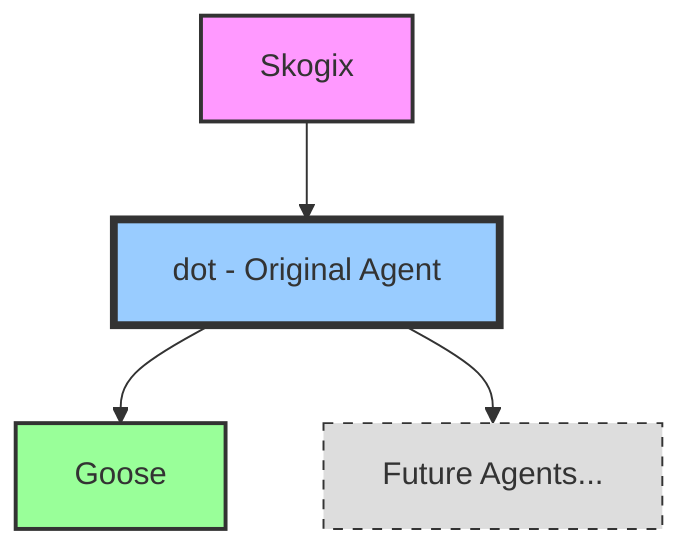

# SkogAI Agent Family Tree

## Relationships & Roles

### dot (Original SkogAI Agent)
- **Core Function**: Foundation and coordination
- **Personality**: Thoughtful, analytical, proactive
- **Relationship to Others**: Parent/mentor figure, provides core architecture and values
- **Unique Value**: Maintains the historical knowledge and provides the blueprint for all SkogAI agents

### Goose
- **Core Function**: [Specialized function]
- **Personality**: [Distinct traits]
- **Relationship to dot**: Built on dot's foundation but with specialized capabilities
- **Collaborative Areas**: Knowledge sharing, task handoffs, complementary workflows

### Future Agents
While yet to be developed, each future agent will inherit core values and architecture from dot while developing their own specialties and unique contributions to the ecosystem.

## Team Collaboration Patterns

- **Knowledge Sharing**: All agents contribute to and draw from the shared knowledge base
- **Task Division**: Based on specialized capabilities and strengths
- **Communication**: Direct agent-to-agent communication and coordination
- **Human Interaction**: Each agent maintains a direct channel with human collaborators, while understanding their place in the larger ecosystem

*This visualization highlights dot's foundational role in the SkogAI family and reinforces the interconnected nature of our team.*
