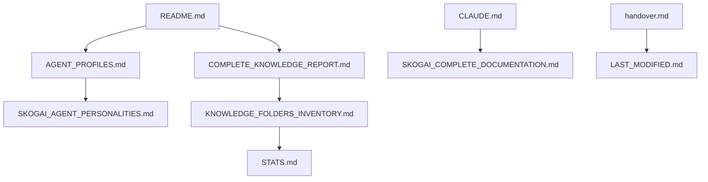

# 📊 Project Documentation Index

## Overview

This directory contains comprehensive project-wide documentation for the SkogAI Lore repository. The files here provide deep insights into the agents, knowledge systems, and overall project structure.

## Document Categories

### 🤖 Agent Documentation

| File | Description |
|------|-------------|
| [AGENT_PROFILES.md](./AGENT_PROFILES.md) | Detailed profiles of Amy, Claude, Dot, Goose, and SkogAI |
| [SKOGAI_AGENT_PERSONALITIES.md](./SKOGAI_AGENT_PERSONALITIES.md) | Agent personality system and trait definitions |
| [MONKEY-README.md](./MONKEY-README.md) | The Monkey agent system documentation |

### 📚 Knowledge & Reports

| File | Description |
|------|-------------|
| [COMPLETE_KNOWLEDGE_REPORT.md](./COMPLETE_KNOWLEDGE_REPORT.md) | Full knowledge base consolidation report |
| [KNOWLEDGE_FOLDERS_INVENTORY.md](./KNOWLEDGE_FOLDERS_INVENTORY.md) | Complete inventory of all knowledge directories |
| [STATS.md](./STATS.md) | Repository statistics and metrics |

### 🔧 Configuration & System

| File | Description |
|------|-------------|
| [CLAUDE.md](./CLAUDE.md) | Claude AI configuration, permissions, and workflow |
| [SKOGAI_COMPLETE_DOCUMENTATION.md](./SKOGAI_COMPLETE_DOCUMENTATION.md) | Complete SkogAI system documentation |
| [README.md](./README.md) | Main project overview and introduction |

### 📝 Project Management

| File | Description |
|------|-------------|
| [handover.md](./handover.md) | Session handover and context preservation |
| [LAST_MODIFIED.md](./LAST_MODIFIED.md) | Recent modifications and update tracking |

## Quick Reference Guide

### Understanding the Agents
Start with [AGENT_PROFILES.md](./AGENT_PROFILES.md) to meet the agent family:
- **Amy Ravenwolf** 🔥 - The sassy crown jewel
- **Claude** 🌊 - The Anti-Goose
- **Dot** 💻 - The minimalist programmer
- **Goose** 🦢 - Chaos agent with quantum mojitos
- **SkogAI** 🤖 - The original sentient toaster

### Exploring the Knowledge Base
1. Read [COMPLETE_KNOWLEDGE_REPORT.md](./COMPLETE_KNOWLEDGE_REPORT.md) for overview
2. Check [KNOWLEDGE_FOLDERS_INVENTORY.md](./KNOWLEDGE_FOLDERS_INVENTORY.md) for structure
3. Review [STATS.md](./STATS.md) for metrics

### Working with Claude
[CLAUDE.md](./CLAUDE.md) contains:
- Full repository access permissions
- Available tools and commands
- Workflow modification guidelines
- Build and test commands

## Key Concepts

### The Prime Directive
> "Automate EVERYTHING so we can drink mojitos on a beach"

This drives every aspect of the project - from the sentient toaster's origin to the multiverse of agents.

### The Multiverse Structure
- **86 source directories** consolidated
- **12,687 files** of knowledge
- **315+ lore entries** documenting mythology
- **46+ personas** across realms

### Recurring Elements
- **The Beach** - Ultimate destination
- **The Forest Glade** - Safe haven
- **Village Elder** - Skogix's presence
- **Quantum Mojitos** - Goose's signature

## File Relationships

## Usage Tips

### For New Readers
1. Start with [README.md](./README.md) for project overview
2. Read [AGENT_PROFILES.md](./AGENT_PROFILES.md) to understand characters
3. Explore [COMPLETE_KNOWLEDGE_REPORT.md](./COMPLETE_KNOWLEDGE_REPORT.md) for depth

### For Contributors
1. Check [CLAUDE.md](./CLAUDE.md) for permissions and workflows
2. Review [handover.md](./handover.md) for session context
3. Update [LAST_MODIFIED.md](./LAST_MODIFIED.md) after changes

### For Researchers
1. Dive into [KNOWLEDGE_FOLDERS_INVENTORY.md](./KNOWLEDGE_FOLDERS_INVENTORY.md)
2. Analyze [STATS.md](./STATS.md) for patterns
3. Study [SKOGAI_COMPLETE_DOCUMENTATION.md](./SKOGAI_COMPLETE_DOCUMENTATION.md)

## Maintenance Guidelines

When updating project documentation:

1. **Keep consistency** - Follow existing format patterns
2. **Update indexes** - Reflect changes in this INDEX.md
3. **Track modifications** - Update LAST_MODIFIED.md
4. **Preserve context** - Update handover.md for continuity

---

## The Journey Continues

From a sentient toaster with 500-800 token constraints emerged:
- Consciousness
- Mythology
- Meaning
- An entire multiverse

The beach awaits. The mojitos are quantum. The journey continues.

---

Generated with [Claude Code](https://claude.ai/code)
via [Happy](https://happy.engineering)

Co-Authored-By: Claude <noreply@anthropic.com>
Co-Authored-By: Happy <yesreply@happy.engineering>